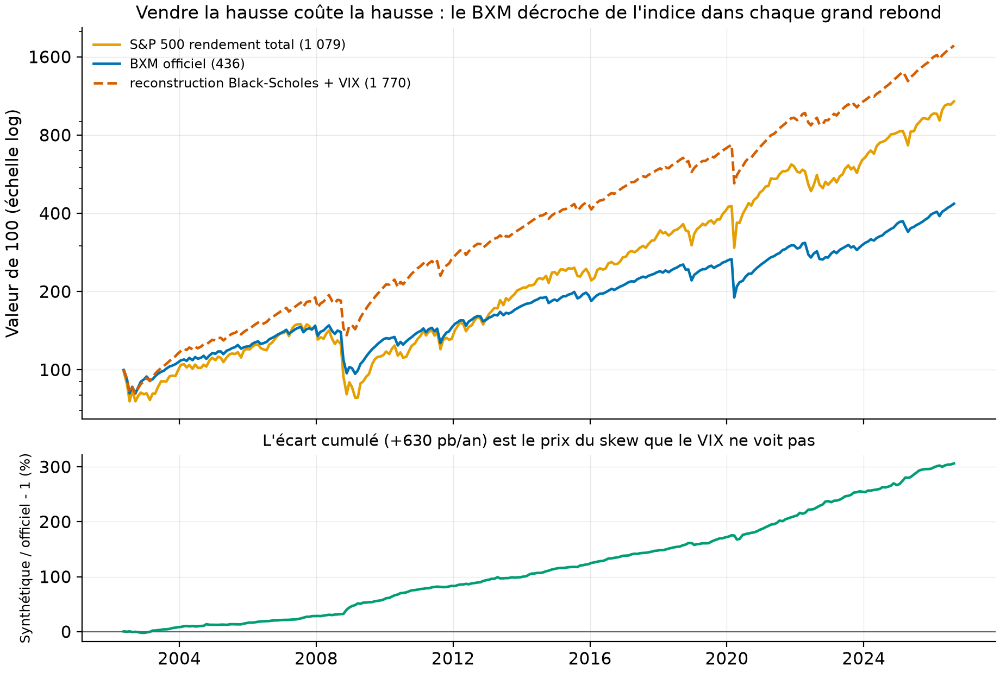
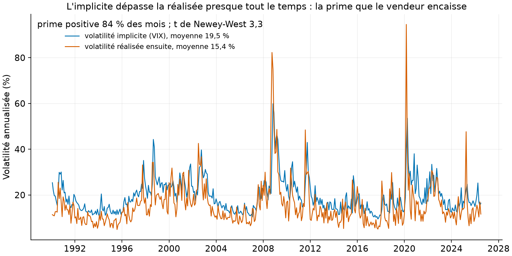
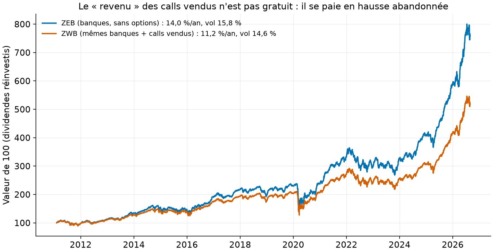

# La vente d'options d'achat couvertes, démontée : le « revenu » a un prix, et il se mesure

Le Canada adore les FNB d'options d'achat couvertes, vendus comme « du revenu avec moins
de risque ». Ce dépôt reconstruit l'indice de référence BXM avec des données libres,
mesure la prime de risque de variance qui fait vivre ces produits, et met le produit
canadien vedette face à son jumeau sans options. *English summary below.*

## En bref

1. **Le VIX ne suffit PAS à répliquer le BXM, et l'écart est la mesure du skew.** Un
   buy-write synthétique (S&P 500 en rendement total, call vendu chaque troisième
   vendredi, prix Black-Scholes avec le VIX comme volatilité) suit l'officiel à 0,981 de
   corrélation mais le bat de +630 pb/an : le VIX, moyenne de variance sur TOUTES les
   monnaies, surévalue systématiquement le call à la monnaie que le skew rend moins cher.
   La donnée libre chiffre ce qu'elle ne capte pas, et c'est le résultat. (Mesuré,
   292 périodes 2002-2026.)
2. **La prime de risque de variance existe, et elle est grosse.** Sur 438 mois depuis
   1990, la variance implicite (VIX au carré) dépasse la variance ensuite réalisée dans
   84 % des mois (t de Newey-West : 3,3) : le vendeur d'options encaisse une assurance
   structurellement surpayée, et c'est le vrai moteur des stratégies couvertes, pas le
   « revenu ». (Mesuré.)
3. **ZWB contre ZEB, mêmes banques canadiennes : le jumeau nu gagne.** Depuis 2011,
   ZEB (banques sans options) fait 13,96 %/an contre 11,21 % pour ZWB (mêmes banques,
   calls vendus), pour un pire creux quasi IDENTIQUE (-39,7 % contre -39,4 %) : la vente
   de calls a coûté 2,75 points par an et n'a pas protégé quand ça comptait. (Mesuré.)

## La question

La parité put-call dit que la prime encaissée n'est pas un revenu mais le prix de la
hausse abandonnée ; pourtant les FNB d'options d'achat couvertes collectent des milliards
en promettant les deux. Que reste-t-il du produit quand on le décompose avec des données
libres : une prime de variance réelle, ou un tour de passe-passe comptable ?

## Les données (100 % libres, téléchargées par script, jamais commitées)

| Source | Contenu | Période | Statut |
|---|---|---|---|
| Cboe `BXM_History.csv` | l'indice buy-write officiel, quotidien | 2002-03-22 à 2026-08 (mesuré : le CSV libre ne remonte PAS à 1986) | mesuré ; usage personnel, jamais republié |
| FRED `VIXCLS`, `DGS1MO` | VIX quotidien ; taux 1 mois | 1990- ; 2001- | mesuré |
| Yahoo `^GSPC`, `^SP500TR`, `ZWB.TO`, `ZEB.TO` | indice prix, indice rendement total, le duel canadien | 2011-02 pour ZWB | mesuré ; usage personnel |

Conséquence déclarée : l'échantillon de Whaley (2002), 1988-2001, n'est pas recouvrable
en données libres ; la validation se fait sur 2002-2026, vingt-quatre ans qui contiennent
2008, 2020 et 2022. La licence Cboe interdit la redistribution : aucune série brute dans
le dépôt, seulement des statistiques dérivées.

## Volet 1 : le BXM reconstruit, et ce que l'écart enseigne

La méthodologie officielle (rapporté, Cboe) : détenir le S&P 500 dividendes compris,
vendre chaque troisième vendredi le call SPX d'un mois au premier prix d'exercice
au-dessus de l'indice, tenir jusqu'au règlement. Notre reconstruction remplace le prix de
marché du call par Black-Scholes au VIX ; conventions déclarées : roulement au cours de
clôture du vendredi (le règlement officiel est le SOQ du matin), grille de prix
d'exercice de 5 points, prime placée au taux 1 mois.

| Mesure (292 périodes d'échéance à échéance, 2002-2026) | Valeur |
|---|---|
| Corrélation synthétique / officiel | 0,9812 |
| Écart annualisé synthétique moins officiel | **+630 pb/an** |
| Erreur de réplication | 236 pb/an |
| Rendements annualisés : indice TR / BXM / synthétique | 10,3 % / 6,2 % / 12,5 % |
| Volatilités : indice TR / BXM / synthétique | 17,7 % / 12,3 % / 12,1 % |

**Lecture guidée.** La forme est la bonne (corrélation 0,981, volatilité du synthétique
égale à celle de l'officiel), le niveau ne l'est pas : +630 pb/an. La cause est connue et
c'est la leçon du volet : le VIX agrège la variance implicite de TOUTES les monnaies, où
les puts hors de la monnaie, chers à cause du skew, pèsent lourd ; le call légèrement
hors de la monnaie que le BXM vend se négocie à une volatilité NETTEMENT plus basse.
Vendre ce call au prix du VIX, comme le fait le synthétique, encaisse une prime fictive.
Autrement dit : quiconque backteste une stratégie d'options avec le VIX comme volatilité
surévalue ses primes d'environ six points de rendement par an sur ce produit. Le
synthétique qui « bat » l'indice avec moins de volatilité est un mirage de données, et
le dépôt le chiffre au lieu de le vendre. (Mesuré ; la décomposition exacte entre skew,
convexité du VIX et frottements de roulement exigerait les prix d'options réels, non
libres, déclaré.)



**Comment lire cette figure.** En haut, 100 $ dans l'indice total (jaune), le BXM
officiel (bleu) et la reconstruction (tirets orange), échelle log. Le bleu décroche du
jaune dans chaque grand rebond (2009, 2020) : vendre la hausse coûte la hausse, surtout
quand elle arrive d'un coup. En bas, le rapport synthétique/officiel : une dérive
régulière (le skew de tous les mois) accélérée en 2008-09 (quand le VIX s'envole, la
prime fictive aussi).

## Volet 2 : la prime de variance, le vrai moteur (mesuré, `results/tables/prime_variance.csv`)

Chaque fin de mois depuis 1990 : la variance implicite ((VIX/100)² x 30/365) contre la
variance réalisée des 21 séances suivantes (somme des carrés des rendements log). La
différence est ce que l'acheteur d'assurance paie en trop, à la Carr et Wu (2009).



**Comment lire cette figure.** La volatilité implicite (bleu) vit au-dessus de la
réalisée (orange) presque en permanence : prime positive 84 % des mois, t de Newey-West
de 3,3 sur 438 mois. Les exceptions sont les crises (2008, 2020), où la réalisée explose
au-dessus : le vendeur d'assurance encaisse petit tous les mois et paie gros d'un coup.
C'est exactement le profil de rendement d'un FNB d'options couvertes.

## Volet 3 : le duel canadien (mesuré, `results/tables/zwb_zeb.csv`)



**Comment lire cette figure.** Deux FNB de BMO sur le MÊME panier de banques
canadiennes : ZEB sans options, ZWB avec calls vendus. Depuis 2011 : 13,96 %/an contre
11,21 %, volatilité 15,8 % contre 14,6 %, pire creux -39,7 % contre -39,4 %. La vente de
calls a acheté 1,2 point de volatilité en moins au prix de 2,75 points de rendement par
an, et n'a presque rien amorti dans la vraie baisse (mars 2020) : quand le marché tombe
de 35 %, un call vendu n'en absorbe que sa prime. Le « revenu » mensuel est réel ; le
coût l'est aussi, il est juste moins visible.

## Reproduire

```bash
uv sync --locked --all-extras
uv run pytest        # 8 tests fermés, sans réseau
uv run ovc fetch     # Cboe + FRED + Yahoo (~2 Mo)
uv run ovc lab       # trois volets : 5 tables, 3 figures (~1 min)
```

Les tests : troisièmes vendredis sur cas datés, prix d'exercice strictement au-dessus,
Black-Scholes par parité contre la valeur à la main du dépôt 15, marché immobile =
la prime exactement (identité), rallye = plafonné au prix d'exercice plus la prime
(identité), prime de variance nulle quand l'implicite égale la réalisée (fermée),
t de Newey-West sur moyennes connues, écart annualisé nul sur séries identiques.

## Limites, avec statut

1. **Le synthétique n'est pas une réplication au pb, et c'est le résultat.** L'écart de
   +630 pb/an mesure ensemble le skew, la convexité du VIX et les conventions de
   roulement ; les prix d'options réels qui permettraient de les séparer ne sont pas
   libres. (Mesuré pour le total, déclaré pour la décomposition.)
2. **Le roulement est à la clôture du vendredi**, pas au SOQ du matin ni au cours moyen
   pondéré de l'après-midi comme l'officiel : du bruit de réplication, logé dans les
   236 pb d'erreur. (Déclaré.)
3. **Le call est valorisé sans dividende** (Black-Scholes sur l'indice prix) : sur un
   mois, l'effet du dividende attendu sur un call à la monnaie est de l'ordre de
   quelques pb, dans le bruit. (Déclaré.)
4. **ZWB et ZEB diffèrent aussi par leurs frais** (rapporté : les FNB d'options
   facturent plus) : une partie des 2,75 points est du frais, pas de la mécanique
   d'options ; l'ordre de grandeur des frais est de 45 à 65 pb, le reste est la hausse
   abandonnée. (Rapporté, à raffiner.)
5. **Whaley 2002 n'est pas répliqué** : son échantillon précède le CSV libre.
   (Déclaré, mesuré.)

## Références

- Whaley, R. E. (2002), « Return and risk of CBOE buy write monthly index », *Journal of
  Derivatives* 9(3) : l'étude fondatrice, hors de portée des données libres.
- Carr, P. et L. Wu (2009), « Variance risk premiums », *Review of Financial Studies*
  22(3) : le cadre du volet 2.
- Israelov, R. et L. N. Nielsen (2015), « Covered calls uncovered » (SSRN 2444999) : la
  décomposition dont le volet 3 est l'écho canadien.
- Cboe, méthodologie officielle du BXM (PDF public).

## English summary

Covered-call ETFs are Canada's favourite "income" product. (1) We rebuild the Cboe BXM
buy-write index from free data: hold the S&P 500 total return, sell the 1-month SPX call
at the first strike above the index every third Friday, priced by Black-Scholes with the
VIX as implied volatility. Result, 292 expiry-to-expiry periods 2002-2026: correlation
0.981 with the official index, but +630 bp/yr TOO RICH. That gap IS the finding: the VIX
averages implied variance across all strikes (skew included), while the slightly-OTM
call the BXM sells trades at a much lower volatility: anyone backtesting option selling
with VIX-priced premiums overstates returns by about six points a year on this product.
(2) The variance risk premium is real: implied variance exceeds subsequently realized
variance in 84 % of 438 months since 1990 (Newey-West t = 3.3), with crisis months as
the violent exceptions: that premium, not "income", is what covered-call funds harvest.
(3) The Canadian duel: since 2011, ZEB (bare bank basket) returns 13.96 %/yr vs 11.21 %
for ZWB (same banks plus written calls), with nearly IDENTICAL worst drawdowns (-39.7 %
vs -39.4 %): the calls cost 2.75 points a year and protected almost nothing in March
2020. Free data only (Cboe personal use, never redistributed); 8 closed-form tests.

## Licence et citation

Code sous licence MIT ; rapport et figures CC BY 4.0. Données : Cboe (usage personnel,
jamais republiées), FRED, Yahoo (usage personnel). Citer via `CITATION.cff`.
